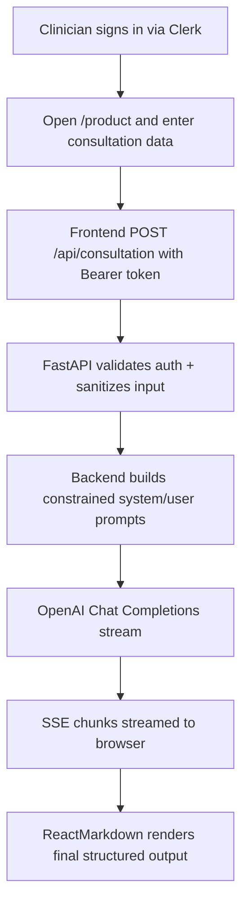
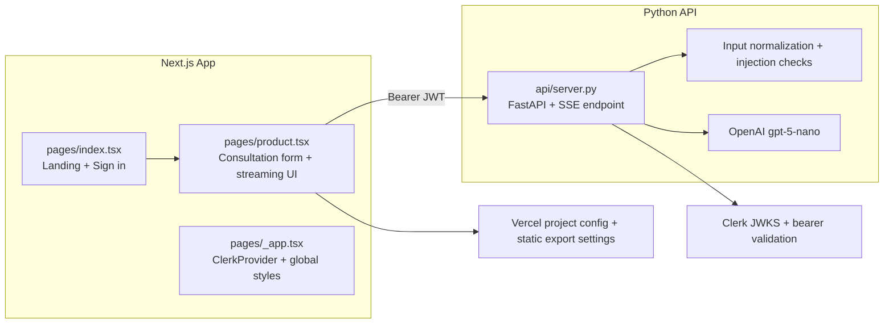

# consultationAI

`consultationAI` is a portfolio-grade, AI-assisted clinical documentation experience.
It combines a `Next.js` frontend and a `FastAPI` backend to generate structured consultation outputs (summary, next steps, and patient-facing communication) from clinician notes.

### Why this project is compelling

- Demonstrates full-stack ownership across frontend UX, backend APIs, auth, and LLM integration.
- Uses streaming responses (`SSE`) for responsive, real-time UX.
- Applies input hardening and basic prompt-injection defenses before calling the model.
- Includes subscription gating and authenticated workflows via `Clerk`.

### Product flow



### Architecture overview



### Tech stack

#### Frontend
- `Next.js 15` (Pages Router, static export enabled in `next.config.ts`)
- `React 19` + `TypeScript`
- `Tailwind CSS 4`
- `Clerk` for authentication/subscription controls
- `react-datepicker`, `react-markdown`, `remark-gfm`, `remark-breaks`
- `@microsoft/fetch-event-source` for streaming consumption

#### Backend
- `FastAPI`
- `pydantic`
- `fastapi-clerk-auth`
- `openai` SDK
- `uvicorn` for local API serving

#### Developer tooling
- `ESLint 9` with `next/core-web-vitals` and TypeScript rules
- TypeScript strict mode enabled (`tsconfig.json`)
- Vercel project configuration present in `.vercel/project.json`

### Repository map

- `pages/index.tsx` — marketing/entry page and auth-aware navigation
- `pages/product.tsx` — protected product UX and streaming summary UI
- `pages/_app.tsx` — app-wide providers and global CSS imports
- `api/server.py` — production-ready FastAPI endpoint (`/api/consultation`)
- `api/index.py` — alternate/lightweight API entry implementation
- `styles/globals.css` — Tailwind + markdown rendering styles

### Local development

#### 1) Install dependencies

```bash
yarn install
```

#### 2) Configure environment variables

Create `.env.local` for the frontend and `.env` for Python runtime as needed.
At minimum, configure:

- `OPENAI_API_KEY`
- `CLERK_JWKS_URL`
- Clerk publishable/secret keys used by the Next app

#### 3) Run frontend

```bash
yarn dev
```

#### 4) Run backend

```bash
pip install -r requirements.txt
uvicorn api.server:app --reload --port 8000
```

### Quality gates (required standards)

This project should be maintained with the following non-negotiable thresholds:

- **Functional code coverage:** `>= 80%`
- **UI coverage:** critical paths covered (auth flow, consultation form, streaming output)
- **Accessibility:** `100%` pass target on agreed checks (axe/Lighthouse policy)
- **Responsiveness:** validated across mobile/tablet/desktop breakpoints

A local, git-ignored quality contract file is supported:

1. Copy `quality-gates.local.example.md` to `quality-gates.local.md`.
2. Keep `quality-gates.local.md` updated with current coverage and audit status.
3. Enforce these checks in CI before merge.

### Recommendations to further impress senior/principal reviewers

1. Add CI pipelines for frontend + backend tests, linting, and coverage reporting.
2. Add Playwright/Cypress E2E tests for the consultation flow and auth gating.
3. Add explicit a11y checks (`axe-core`, Lighthouse CI) and publish reports.
4. Harden CORS (`allow_origins`) and environment-based security settings for production.
5. Consolidate `api/index.py` and `api/server.py` into a single backend entrypoint to reduce drift.
6. Add architecture decision records (`docs/adr`) to explain key trade-offs.

### Deployment notes

- Frontend static export is configured in `next.config.ts` (`output: 'export'`).
- Vercel metadata exists in `.vercel/project.json`.
- Backend deploy target can be containerized (`Dockerfile`) or run on a Python-compatible service.
