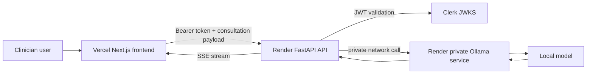

# consultationAI

A healthcare-focused AI documentation assistant that generates structured progress-note narratives from clinician-entered consultation notes.

This project demonstrates full-stack AI application development using a Next.js frontend, FastAPI backend, Clerk authentication, streaming responses, Docker-based deployment, and private Ollama-based model inference. It is designed to show PHI/PII-aware architecture choices for medical AI workflows.

Public demo use is limited to synthetic patient examples only.

## Live demo

- Frontend: `https://saas-bice-iota.vercel.app`
- Backend health check: `https://consultation-api-f1vm.onrender.com/health`
- Demo data policy: synthetic patient examples only. Do not enter real PHI, PII, or regulated clinical data.

## Why this project matters

Medical documentation is a high-value AI use case, but clinical text can contain protected health information and personally identifiable information. This project intentionally avoids sending consultation notes directly to a third-party LLM API in the deployed demo path. Instead, the browser calls a controlled backend, and the backend routes model inference to a private Ollama service.

This is not a production clinical system and does not claim HIPAA compliance. It is a portfolio project that demonstrates practical healthcare AI engineering judgment, including separation of concerns, authentication, private service networking, and a clear synthetic-data-only demo boundary.

## What this project demonstrates

- Full-stack AI application development with React, Next.js, Python, and FastAPI
- Streaming model output to the browser using Server-Sent Events
- Authentication-aware API calls using Clerk-issued bearer tokens
- PHI/PII-aware deployment choices for healthcare workflows
- Private model inference using Ollama rather than a third-party LLM API
- Docker-based backend and model-runtime deployment to Render
- Static frontend deployment to Vercel
- CORS hardening for explicit frontend origins

## Architecture

```text
Vercel frontend
    -> Render FastAPI backend
        -> Render private Ollama service
            -> local/private model inference
```

The deployed model runtime is not publicly exposed. The public browser client communicates only with the backend API. The backend communicates with Ollama over Render private networking.



## Key features

- Authenticated consultation workflow
- Clinician-facing note input form
- Structured output generation for visit summary, doctor next steps, and patient-friendly communication
- Streaming response UI for better perceived performance
- Backend-side input normalization and prompt construction
- Private model runtime path using Ollama
- Explicit CORS configuration for deployed frontend domains
- Clear demo-only warning for synthetic patient data

## Tech stack

### Frontend

- Next.js 15
- React 19
- TypeScript
- Tailwind CSS
- Clerk authentication
- `@microsoft/fetch-event-source` for SSE streaming
- React Markdown rendering

### Backend

- Python
- FastAPI
- Pydantic
- Uvicorn
- Clerk JWT validation through JWKS
- Ollama-compatible model invocation

### Deployment

- Vercel for frontend hosting
- Render Web Service for the FastAPI backend
- Render Private Service for Ollama
- Dockerfiles for separate API and Ollama runtime deployment

## PHI/PII-aware design notes

This project is designed to demonstrate awareness of healthcare data-flow risk. The public demo should use only synthetic patient examples.

Design choices include:

- No third-party LLM API call in the primary deployed inference path
- Browser-to-backend communication over HTTPS
- Backend-to-model communication over private Render networking
- Ollama service not publicly exposed
- Secrets stored in deployment environment variables rather than committed to source control
- CORS restricted to explicit frontend origins
- Authentication required before calling the consultation endpoint
- Operational logs should not include raw patient note content

A production clinical deployment would require additional formal controls, including a full compliance review, business associate agreements where applicable, audited access controls, encryption and key-management policies, retention and deletion policies, monitoring, incident response, backup and recovery procedures, and clinical validation.

## Repository map

```text
pages/
  index.tsx              Landing page and entry flow
  product.tsx            Consultation form and streaming output UI
  _app.tsx               App-level providers and global CSS

api/
  server.py              FastAPI backend entrypoint
  render_start.py        Render startup wrapper for Uvicorn
  llm_provider.py        LLM provider abstraction

render/
  ollama-start.sh        Ollama service startup script

Dockerfile.render-api    Render API Dockerfile
Dockerfile.ollama        Render Ollama Dockerfile

docs/
  ARCHITECTURE.md        Deeper system architecture notes
  DEPLOYMENT.md          Vercel and Render deployment guide
  SECURITY_NOTES.md      Demo security and PHI/PII notes
```

## Local development

Install frontend dependencies:

```bash
yarn install
```

Run the frontend:

```bash
yarn dev
```

Create and activate a Python virtual environment:

```bash
uv venv
source .venv/bin/activate
uv pip install -r requirements.txt
```

Run the backend locally:

```bash
yarn dev:api
```

Run local Ollama:

```bash
ollama serve
ollama pull llama3.2:1b
```

Example local backend environment variables:

```text
LLM_PROVIDER=ollama
OLLAMA_BASE_URL=http://localhost:11434
OLLAMA_MODEL=llama3.2:1b
CLERK_JWKS_URL=<your Clerk JWKS URL>
FRONTEND_ORIGINS=http://localhost:3000
```

## Deployment overview

The deployed demo uses three separate services:

```text
Frontend: Vercel
Backend API: Render Web Service
Model runtime: Render Private Service running Ollama
```

Vercel environment variable:

```text
NEXT_PUBLIC_API_BASE_URL=https://consultation-api-f1vm.onrender.com
```

Render API environment variables:

```text
LLM_PROVIDER=ollama
OLLAMA_BASE_URL=http://consultationai:11434
OLLAMA_MODEL=llama3.2:1b
FRONTEND_ORIGINS=<comma-separated Vercel frontend origins>
CLERK_JWKS_URL=<your Clerk JWKS URL>
```

Render Ollama environment variables:

```text
PORT=11434
OLLAMA_HOST=0.0.0.0:11434
OLLAMA_MODELS=/var/lib/ollama/models
OLLAMA_MODEL=llama3.2:1b
```

See `docs/DEPLOYMENT.md` for a fuller deployment runbook.

## Quality and testing

Recommended quality gates before treating this as portfolio-ready:

- Frontend build passes on Vercel
- Backend health endpoint returns `200`
- CORS preflight passes for all intended Vercel origins
- Consultation endpoint rejects invalid bearer tokens
- Consultation endpoint succeeds with a signed-in Clerk user
- Failed SSE requests do not retry indefinitely
- Accessibility checks pass on the main user flow
- Demo warning is visible near the consultation form

## Future improvements

- Add CI for linting, type checks, unit tests, and backend tests
- Add Playwright or Cypress tests for the consultation flow
- Add accessibility checks with axe or Lighthouse CI
- Add architecture decision records for major deployment choices
- Add rate limiting and abuse protection on the backend
- Add structured logging that explicitly avoids raw consultation note content
- Add a README screenshot or short demo GIF using synthetic data
