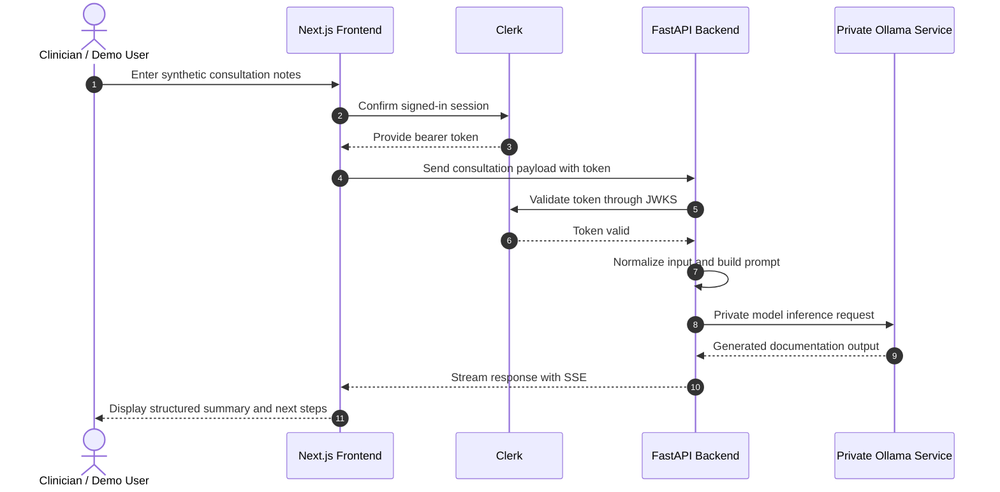
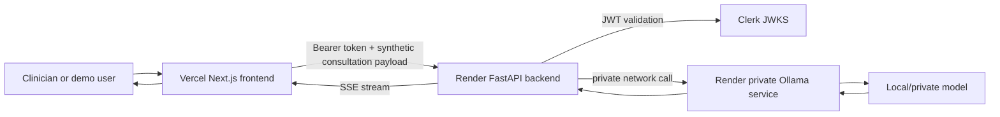

# MediNotes Pro

A healthcare-focused AI documentation assistant that generates structured clinical-style summaries from clinician-entered consultation notes using a Next.js frontend, FastAPI backend, Clerk authentication, streaming responses, Docker-based deployment, and private Ollama-based model inference.

> Repository name: `consultationAI`

This project demonstrates full-stack applied AI engineering for a high-value, high-risk domain: healthcare documentation. It is intentionally designed as a portfolio project using synthetic data only, with explicit PHI/PII boundaries and a private model-runtime architecture.

## Demo and data-safety policy

| Item | Details |
|---|---|
| Frontend demo | [https://saas-bice-iota.vercel.app](https://saas-bice-iota.vercel.app) |
| Backend health check | [https://consultation-api-f1vm.onrender.com/health](https://consultation-api-f1vm.onrender.com/health) |
| Demo data policy | Synthetic patient examples only |
| Real PHI/PII | Do not enter real patient data, PHI, PII, or regulated clinical content |
| Compliance status | Portfolio demonstration only. Not a production clinical system and not a claim of HIPAA compliance |

## At a glance

| Area | Details |
|---|---|
| Product | Healthcare-focused AI documentation assistant |
| Frontend | Next.js, React, TypeScript, Tailwind CSS |
| Backend | FastAPI, Python, Pydantic, Uvicorn |
| Authentication | Clerk |
| AI runtime | Ollama-compatible private model service |
| UX pattern | Streaming responses using Server-Sent Events |
| Deployment | Vercel frontend, Render backend, Render private Ollama service |
| Safety posture | Synthetic/demo data only; no real PHI/PII |
| Portfolio value | Healthcare AI judgment, full-stack implementation, private inference path, deployment-aware architecture |

## Why this project matters

Medical documentation is one of the most obvious use cases for AI, but it is also one of the easiest places to make unsafe engineering choices. Clinical notes may contain protected health information, personally identifiable information, and context that requires careful handling.

MediNotes Pro is designed to demonstrate healthcare AI engineering judgment rather than simply wrapping a text box around an LLM. The deployed demo path avoids sending consultation notes directly from the browser to a third-party LLM API. Instead, the browser calls a controlled backend, and the backend routes inference to a private Ollama service.

This project shows how a healthcare AI workflow can be structured with:

- A clear synthetic-data-only boundary.
- Authentication-aware API calls.
- Backend-controlled prompt construction.
- Private model runtime networking.
- Streaming output for better user experience.
- Explicit non-production and non-compliance disclaimers.
- A documented path toward the controls required for real clinical use.

## What this project demonstrates

- Full-stack AI application development with React, Next.js, Python, and FastAPI.
- Streaming model output to the browser using Server-Sent Events.
- Authentication-aware backend requests using Clerk-issued bearer tokens.
- PHI/PII-aware architecture choices for healthcare workflows.
- Private model inference using Ollama rather than a direct browser-to-LLM pattern.
- Docker-based deployment for separate API and model-runtime services.
- Static frontend deployment through Vercel.
- Backend deployment through Render.
- CORS hardening for explicit frontend origins.
- Clear separation between portfolio demonstration and production clinical use.

## Product flow



## Architecture



The public browser client communicates only with the backend API. The backend communicates with the Ollama model runtime over private networking. The model runtime is not publicly exposed.

## Key features

- Authenticated consultation workflow.
- Clinician-facing note input form.
- Structured AI-generated output.
- Visit-summary style documentation.
- Doctor next-step suggestions.
- Patient-friendly communication output.
- Streaming response UI.
- Backend-side input normalization.
- Backend-controlled prompt construction.
- Private Ollama model runtime path.
- Explicit CORS configuration.
- Synthetic-data-only demo warning.

## Tech stack

### Frontend

- Next.js 15
- React 19
- TypeScript
- Tailwind CSS
- Clerk authentication
- `@microsoft/fetch-event-source` for SSE streaming
- React Markdown rendering

### Backend

- Python
- FastAPI
- Pydantic
- Uvicorn
- Clerk JWT validation through JWKS
- Ollama-compatible model invocation

### Deployment

- Vercel for frontend hosting
- Render Web Service for the FastAPI backend
- Render Private Service for Ollama
- Separate Dockerfiles for API and model-runtime deployment

## PHI/PII-aware design notes

This project is designed to demonstrate awareness of healthcare data-flow risk.

The public demo should use only synthetic patient examples.

Design choices include:

- No direct browser-to-third-party-LLM call in the deployed inference path.
- Browser-to-backend communication over HTTPS.
- Backend-to-model communication over private Render networking.
- Ollama service not publicly exposed.
- Secrets stored in deployment environment variables rather than source control.
- CORS restricted to explicit frontend origins.
- Authentication required before calling the consultation endpoint.
- Operational logs should not include raw consultation note content.
- Demo warnings should remain visible near the consultation form.

A production clinical deployment would require additional formal controls, including compliance review, business associate agreements where applicable, audited access controls, encryption and key-management policies, retention and deletion policies, monitoring, incident response, backup and recovery procedures, and clinical validation.

## Repository map

```text
pages/
  index.tsx              Landing page and entry flow
  product.tsx            Consultation form and streaming output UI
  _app.tsx               App-level providers and global CSS

api/
  server.py              FastAPI backend entrypoint
  render_start.py        Render startup wrapper for Uvicorn
  llm_provider.py        LLM provider abstraction

render/
  ollama-start.sh        Ollama service startup script

Dockerfile.render-api    Render API Dockerfile
Dockerfile.ollama        Render Ollama Dockerfile

docs/
  ARCHITECTURE.md        Deeper system architecture notes
  DEPLOYMENT.md          Vercel and Render deployment guide
  SECURITY_NOTES.md      Demo security and PHI/PII notes
```

## Reviewer path

For hiring managers and engineers reviewing this project:

1. Read the demo and data-safety policy.
2. Review the architecture diagram.
3. Open the frontend demo using synthetic data only.
4. Inspect the consultation form and streaming output behavior.
5. Review `api/server.py` and `api/llm_provider.py`.
6. Review the Render/Vercel deployment notes.
7. Review the security notes and PHI/PII limitations.
8. Check the future improvements for production-hardening awareness.

## Local development

Install frontend dependencies:

```bash
yarn install
```

Run the frontend:

```bash
yarn dev
```

Create and activate a Python virtual environment:

```bash
uv venv
source .venv/bin/activate
uv pip install -r requirements.txt
```

Run the backend locally:

```bash
yarn dev:api
```

Run local Ollama:

```bash
ollama serve
ollama pull llama3.2:1b
```

Example local backend environment variables:

```text
LLM_PROVIDER=ollama
OLLAMA_BASE_URL=http://localhost:11434
OLLAMA_MODEL=llama3.2:1b
CLERK_JWKS_URL=
FRONTEND_ORIGINS=http://localhost:3000
```

## Deployment overview

The deployed demo uses three separate services:

```text
Frontend:      Vercel
Backend API:   Render Web Service
Model runtime: Render Private Service running Ollama
```

Vercel environment variable:

```text
NEXT_PUBLIC_API_BASE_URL=https://consultation-api-f1vm.onrender.com
```

Render API environment variables:

```text
LLM_PROVIDER=ollama
OLLAMA_BASE_URL=http://consultationai:11434
OLLAMA_MODEL=llama3.2:1b
FRONTEND_ORIGINS=
CLERK_JWKS_URL=
```

Render Ollama environment variables:

```text
PORT=11434
OLLAMA_HOST=0.0.0.0:11434
OLLAMA_MODELS=/var/lib/ollama/models
OLLAMA_MODEL=llama3.2:1b
```

See `docs/DEPLOYMENT.md` for a fuller deployment runbook.

## Quality and testing checklist

Recommended quality gates before treating this as portfolio-ready:

- Frontend build passes on Vercel.
- Backend health endpoint returns `200`.
- CORS preflight passes for intended frontend origins.
- Consultation endpoint rejects invalid bearer tokens.
- Consultation endpoint succeeds with a signed-in Clerk user.
- Failed SSE requests do not retry indefinitely.
- Demo warning is visible near the consultation form.
- Main flow passes basic accessibility checks.
- Backend logs avoid raw consultation note content.

## Known limitations

- This is a portfolio demonstration, not production clinical software.
- The public demo must use synthetic data only.
- The project does not claim HIPAA compliance.
- Output quality depends on the selected model and prompt behavior.
- Clinical output should not be used for real patient care.
- A production deployment would require formal compliance, audit, validation, and monitoring controls.
- The deployed model choice may be constrained by hosting cost and resource limits.

## Future improvements

- Add CI for linting, type checks, unit tests, and backend tests.
- Add Playwright or Cypress tests for the consultation flow.
- Add accessibility checks with axe or Lighthouse CI.
- Add architecture decision records for major deployment choices.
- Add rate limiting and abuse protection on the backend.
- Add structured logging that explicitly avoids raw consultation note content.
- Add a README screenshot or short demo GIF using synthetic data.
- Add request/response evaluation examples using synthetic notes.
- Add a clearer model-selection strategy for local versus hosted inference.

## Author

Brian E. Kane  
Full-Stack AI Engineer | Senior Software Engineer | Healthcare Technology  
[BrianEKane.com](https://www.brianekane.com) · [GitHub](https://github.com/bkane56) · [LinkedIn](https://www.linkedin.com/in/brian-kane-396a8862/)
