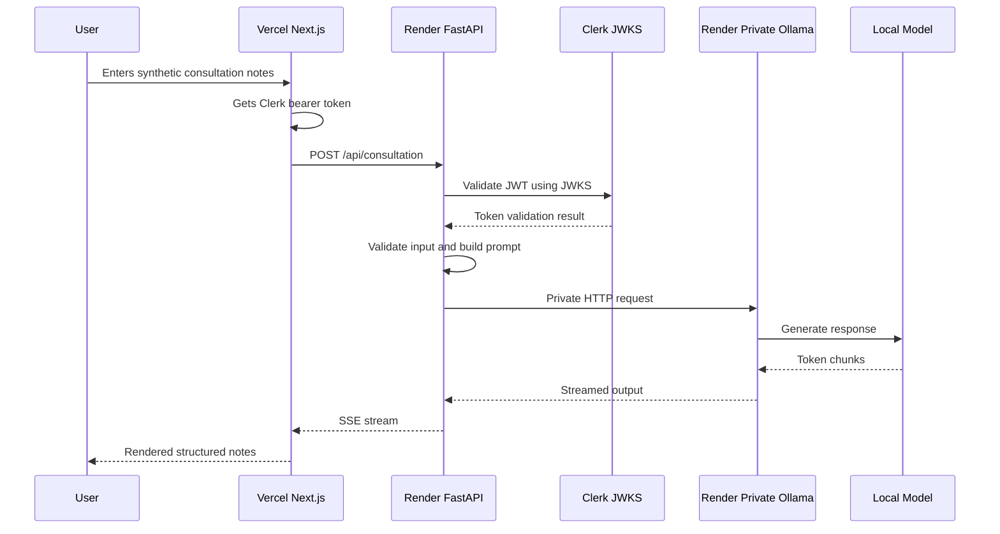

# Architecture

This document explains the deployed architecture for `consultationAI` and the design choices behind it.

## System goal

The application generates structured progress-note narratives from clinician-entered consultation notes. The project is designed as a healthcare-focused AI portfolio application and uses synthetic patient data only.

The architecture is intentionally shaped around PHI/PII-aware data-flow decisions. The public demo does not send clinical note text directly to a third-party LLM API. Instead, the backend routes inference to a private Ollama service.

## Deployed topology

```text
Vercel frontend
    -> Render FastAPI backend
        -> Render private Ollama service
            -> local/private model inference
```

## Main components

### Frontend

The frontend is a Next.js application hosted on Vercel.

Responsibilities:

- Render the public and authenticated UI
- Collect synthetic consultation input
- Retrieve a Clerk bearer token
- Call the backend API using `NEXT_PUBLIC_API_BASE_URL`
- Consume streaming responses through Server-Sent Events
- Render structured Markdown output

The frontend should never call Ollama directly.

### Backend API

The backend is a FastAPI service hosted as a Render Web Service.

Responsibilities:

- Receive browser requests over HTTPS
- Validate Clerk bearer tokens
- Enforce CORS for known frontend origins
- Normalize and validate consultation input
- Build constrained prompts for the model runtime
- Call the private Ollama service
- Stream output back to the browser

The backend is the public API boundary. It is the only public service that talks to the model runtime.

### Ollama service

Ollama runs as a Render Private Service.

Responsibilities:

- Host the local model runtime
- Listen on the private service address
- Serve model responses only to the backend service

The Ollama service is not intended to be reachable from the public internet.

## Request flow



## Trust boundaries

```text
Browser boundary
Frontend hosting boundary
Public backend API boundary
Private model-runtime boundary
Authentication provider boundary
```

The backend is the key control point. It separates the public client from the private model runtime.

## Why Ollama is private

The project is healthcare-focused. Consultation text may resemble regulated clinical text, even when entered as a demo. Keeping inference inside a private service demonstrates a safer data-flow pattern than sending note text directly from the browser or backend to a third-party LLM API.

This does not make the application production compliant by itself. It does demonstrate awareness of where clinical text flows and how to reduce unnecessary external exposure.

## Why the backend is separate from the frontend

The frontend is statically hosted on Vercel. The backend runs separately because it needs long-lived streaming responses, authentication validation, backend environment variables, and private network access to the model runtime.

This separation also keeps model-runtime details out of the browser.

## Streaming response design

The frontend uses Server-Sent Events to receive model output as it is generated.

Benefits:

- Better perceived response time
- Natural fit for token streaming
- Simple browser consumption pattern
- Clear separation between request submission and streamed output rendering

Failure handling should stop retries after fatal errors. The frontend `fetchEventSource` `onerror` handler should throw after aborting the controller.

## Environment boundaries

Frontend environment variable:

```text
NEXT_PUBLIC_API_BASE_URL=https://consultation-api-f1vm.onrender.com
```

Backend environment variables:

```text
LLM_PROVIDER=ollama
OLLAMA_BASE_URL=http://consultationai:11434
OLLAMA_MODEL=llama3.2:1b
FRONTEND_ORIGINS=<allowed frontend origins>
CLERK_JWKS_URL=<Clerk JWKS URL>
```

Ollama environment variables:

```text
PORT=11434
OLLAMA_HOST=0.0.0.0:11434
OLLAMA_MODELS=/var/lib/ollama/models
OLLAMA_MODEL=llama3.2:1b
```

## Design trade-offs

### Using Render private networking

Benefit: keeps Ollama off the public internet and allows backend-to-model communication over a private service address.

Trade-off: requires careful service naming, matching regions, correct private host and port, and sufficient instance resources.

### Using a small model for the demo

Benefit: lowers hosting cost and allows the architecture to remain live for portfolio review.

Trade-off: output quality may be weaker than a larger model such as `llama3.1:8b`.

### Using synthetic data only

Benefit: prevents real PHI/PII from entering a demo environment.

Trade-off: the system is not validated for real clinical use.

## Recommended production additions

A real clinical deployment would need additional controls, including:

- Formal security and privacy review
- Business associate agreements where applicable
- Audited role-based access controls
- Encryption at rest and in transit
- Key lifecycle management
- Data retention and deletion policies
- Rate limiting and abuse protection
- Operational monitoring and incident response
- Backup and recovery strategy
- Clinical validation and human-in-the-loop review
- Logging controls that avoid raw PHI capture
